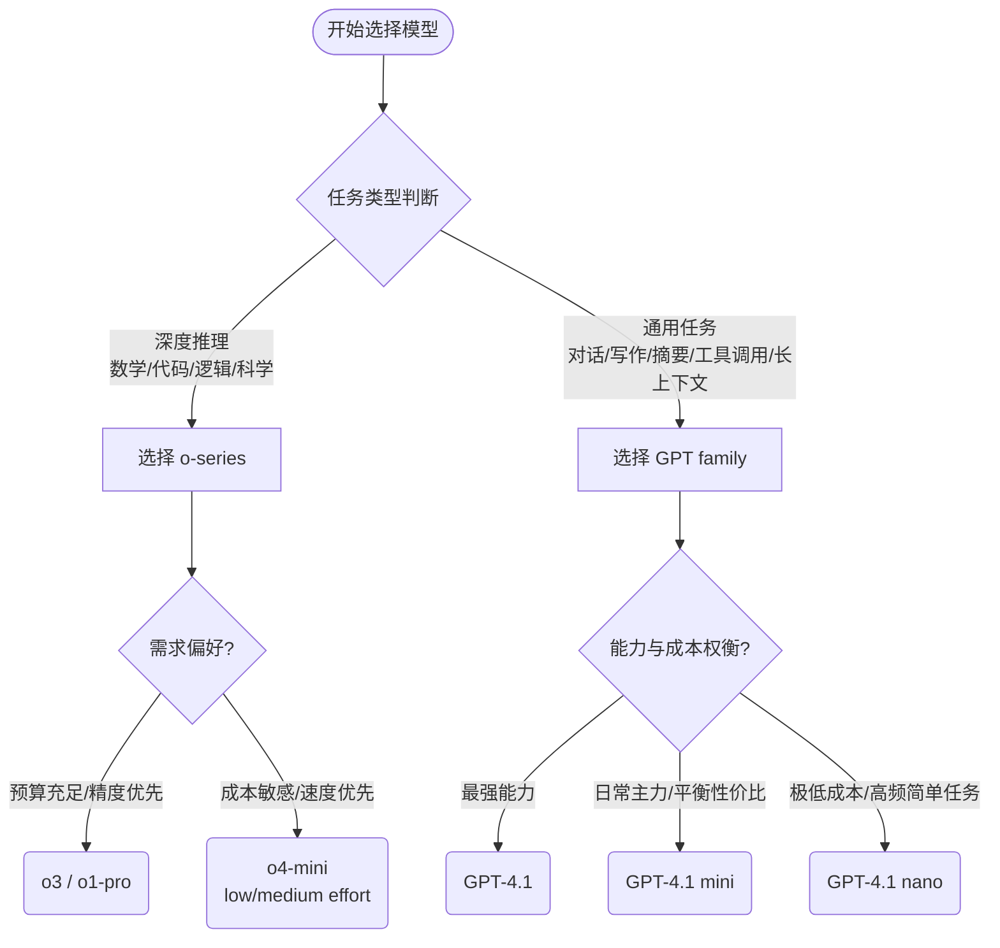

---
title:
date:
tags:
aliases:
cssclasses:
status: in-progress
rating:
completed: false
due:
---
http://github.com/openai/openai-cookbook/blob/main/images/2.2_model_evolution.png
## 两条产品线的根本差异

|维度|Reasoning o-series|Non-reasoning GPT family|
|---|---|---|
|核心机制|内置"隐式思维链"，回答前先深度推理|直接生成回答，无内部推理步骤|
|适合任务|数学、代码、逻辑、科学推导等需要"想清楚"的任务|对话、写作、摘要、指令执行、Agent 工具调用|
|延迟特点|较高（思考需要时间）|低延迟，响应快|
|成本|偏高|更经济，有 nano 级极低成本选项|
|Prompt 风格|不需要 CoT 提示，模型自己会推理|可以用 prompt 引导推理风格|

---

## o-series 分支的设计原则

**核心理念：用"计算换准确率"——让模型多花时间思考，提升复杂任务的正确率。**

- `o1`：旗舰推理模型，能力最强，是整条线的"能力锚点"。
    
- `o1-pro`：o1 的增强版，给需要"更多推理算力"的场景用，定位高端。
    
- `o3`：o1-pro 的下一代，能力进一步提升。
    
- `o1-mini`：从 o1 直接衍生，保留推理能力，压缩体积，降低成本和延迟。
    
- `o3-mini`：o1-mini 的下一代，在 mini 尺寸上延续推理能力的迭代。
    
- `o4-mini`：目前这条线最新的小模型，延续"高效推理"路线。
    

**设计模式：两条并行演化的子线——"旗舰线（o1→o1-pro→o3）"追求极限能力，"mini 线（o1-mini→o3-mini→o4-mini）"追求性价比推理。**

底部备注说明：截至 2025 年 4 月，o-series 所有模型都支持把 reasoning effort 设为 low / medium / high，让你自己决定"花多少算力思考"。

---

## GPT family 分支的设计原则

**核心理念：用"尺寸梯度"覆盖不同成本/速度需求，同时保持强大的指令跟随和工具调用能力。**

- `GPT-4o`：旗舰多模态模型，文本 + 图像 + 音频，能力全面，是这条线的"能力锚点"。
    
- `GPT-4.1`：从 GPT-4o 衍生，专门优化了指令跟随、长上下文（1M tokens）、Agent 工具调用，定位"生产级工程模型"。
    
- `GPT-4o mini`：从 GPT-4o 直接衍生，保留多模态能力，大幅压缩成本。
    
- `GPT-4.1 mini`：GPT-4.1 和 GPT-4o mini 都指向它，是"平衡性价比"的主力模型，适合大多数常规任务。
    
- `GPT-4.1 nano`：整条线最轻量，极低成本、极低延迟，适合简单分类、路由、高频低价值调用等场景。
    

**设计模式：以 GPT-4.1 mini 为"中心节点"，往上走能力，往下走极致轻量，形成一个完整的成本梯队。**

---

## 如何在两条线之间选择

根据 [[ChatGPT两条产品线差异分析]] 中的内容，将这段选择逻辑整理为流程图和层级列表两种格式：

### 1. 决策流程图

### 2. 结构化列表

- **任务需要“深度推理”（数学 / 代码 / 逻辑 / 科学）？**
  - → **使用 o-series**
    - 预算充足 / 精度优先
      - → **o3 / o1-pro**
    - 成本敏感 / 速度优先
      - → **o4-mini** (配置 low/medium effort)

- **任务是“对话 / 写作 / 摘要 / Agent 工具调用 / 长上下文”？**
  - → **使用 GPT family**
    - 最强能力需求
      - → **GPT-4.1**
    - 日常主力 / 性价比平衡
      - → **GPT-4.1 mini**
    - 极低成本 / 高频简单任务
      - → **GPT-4.1 nano**

**一句话总结：o-series 是"慢想型"，GPT family 是"快反型"，两条线不是竞争关系，而是互补关系，按任务性质选择比按能力排名选择更重要。**

