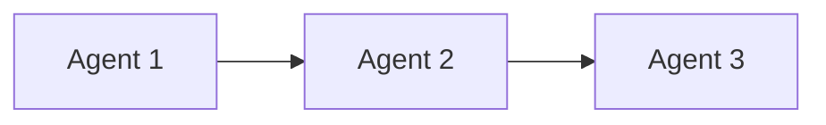
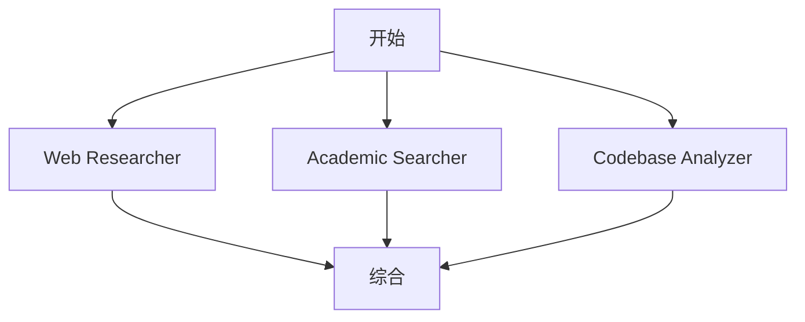

# Agent Team Orchestration System - 开发者指南

> 版本: 1.0.0
> 最后更新: 2025年2月
> 状态: 生产就绪

---

## 目录

- [1. 系统架构](#1-系统架构)
- [2. 开发环境设置](#2-开发环境设置)
- [3. 核心API参考](#3-核心api参考)
- [4. Agent开发指南](#4-agent开发指南)
- [5. 工作流开发指南](#5-工作流开发指南)
- [6. 扩展和定制](#6-扩展和定制)
- [7. 测试和调试](#7-测试和调试)
- [8. 性能优化](#8-性能优化)
- [9. 故障排除](#9-故障排除)
- [10. 最佳实践](#10-最佳实践)
- [11. 贡献指南](#11-贡献指南)

---

## 1. 系统架构

### 1.1 整体架构

```
┌─────────────────────────────────────────────────────────┐
│                    用户接口层                           │
│  ┌──────────────┬──────────────┬──────────────────┐   │
│  │ CLI命令     │ Bash脚本    │ 未来: Web UI     │   │
│  └──────────────┴──────────────┴──────────────────┘   │
└─────────────────────────────────────────────────────────┘
                          ↓
┌─────────────────────────────────────────────────────────┐
│                  协调编排层 (Orchestration)             │
│  ┌─────────────────────────────────────────────────┐  │
│  │  AgentTeamCoordinator                           │  │
│  │  - 工作流管理                                   │  │
│  │  - Agent调度                                    │  │
│  │  - 执行模式控制 (Pipeline/Parallel/Hybrid)      │  │
│  └─────────────────────────────────────────────────┘  │
│  ┌──────────────────┬──────────────────────────────┐  │
│  │ ContextBridge    │ ResultSynthesizer           │  │
│  │ - 状态管理       │ - 多源综合                  │  │
│  │ - 上下文传递     │ - 冲突解决                  │  │
│  └──────────────────┴──────────────────────────────┘  │
└─────────────────────────────────────────────────────────┘
                          ↓
┌─────────────────────────────────────────────────────────┐
│                   Agent执行层                           │
│  ┌─────────┬──────────┬──────────┬────────────────┐   │
│  │Research │Analysis   │Synthesis │Reporting       │   │
│  │Agents   │Agents     │Agents    │Agents          │   │
│  └─────────┴──────────┴──────────┴────────────────┘   │
└─────────────────────────────────────────────────────────┘
                          ↓
┌─────────────────────────────────────────────────────────┐
│                  持久化层 (Storage)                     │
│  ┌──────────────┬──────────────┬──────────────────┐   │
│  │ Agent定义    │ 工作流定义   │ 状态持久化       │   │
│  │ (.md files)  │ (.md files)  │ (.json/.jsonl)   │   │
│  └──────────────┴──────────────┴──────────────────┘   │
└─────────────────────────────────────────────────────────┘
                          ↓
┌─────────────────────────────────────────────────────────┐
│                   外部工具集成                          │
│  ┌──────────┬──────────┬──────────┬────────────────┐   │
│  │ tmux会话 │ MCP工具  │ Claude CLI│ 未来: 更多    │   │
│  └──────────┴──────────┴──────────┴────────────────┘   │
└─────────────────────────────────────────────────────────┘
```

### 1.2 核心组件关系

```
┌──────────────────────────────────────────────────────────┐
│                     工作流执行流程                       │
└──────────────────────────────────────────────────────────┘

用户请求
    ↓
AgentTeamCoordinator.start_agent_team(workflow_id)
    ↓
┌──────────────────────────────────────────┐
│ 根据workflow.pattern选择执行模式         │
│ - pipeline: _execute_pipeline()          │
│ - parallel: _execute_parallel()          │
│ - hybrid: _execute_hybrid()              │
└──────────────────────────────────────────┘
    ↓
┌──────────────────────────────────────────┐
│ 对每个agent调用_run_agent_in_tmux()      │
│ - 准备上下文 (ContextBridge)             │
│ - 创建tmux会话                           │
│ - 启动agent进程                          │
└──────────────────────────────────────────┘
    ↓
┌──────────────────────────────────────────┐
│ 等待agent完成 (_wait_for_agent_completion)│
│ - 检查tmux会话状态                        │
│ - 收集输出结果                           │
│ - 处理超时和错误                          │
└──────────────────────────────────────────┘
    ↓
┌──────────────────────────────────────────┐
│ ResultSynthesizer综合结果                │
│ - 应用加权策略                           │
│ - 检测冲突                               │
│ - 生成最终报告                           │
└──────────────────────────────────────────┘
    ↓
输出结果 (Obsidian Markdown报告)
```

### 1.3 数据流

```python
# 上下文传递数据流
initial_context = {
    "research_question": "...",
    "user_preferences": {...}
}

# Agent 1 执行
agent1_output = {
    "findings": [...],
    "sources": [...],
    "output_context": {
        "key_insight": "...",
        "next_steps": [...]
    }
}

# ContextBridge 更新
context_bridge.update_agent_output(
    agent_id="agent_1",
    output=agent1_output,
    extract_to_shared=["key_insight"]  # 提取到共享状态
)

# Agent 2 获取上下文
agent2_context = context_bridge.prepare_context_for_agent(
    agent_id="agent_2",
    task_description="...",
    include_history=True,
    include_shared_state=True
)
# agent2_context 现在包含:
# - agent_1 的输出
# - 共享状态 (key_insight)
# - 协作历史
```

---

## 2. 开发环境设置

### 2.1 系统要求

```yaml
必需:
  Python: ">=3.8"
  操作系统: Linux/macOS/WSL2

可选:
  tmux: ">=3.0"  # 用于持久化会话
  Claude CLI: "latest"  # 用于运行agents

推荐:
  内存: ">=4GB"
  磁盘: ">=1GB可用空间"
```

### 2.2 安装步骤

```bash
# 1. 克隆或进入工作目录
cd /path/to/obsidianDoc26

# 2. 验证目录结构
bash scripts/orchestration/test-agents.sh

# 3. (可选) 安装tmux
sudo apt-get install tmux  # Ubuntu/Debian
brew install tmux            # macOS

# 4. 验证Python版本
python3 --version  # 应该 >=3.8

# 5. 测试核心组件
python3 scripts/orchestration/agent-team-coordinator.py --list-agents
```

### 2.3 IDE配置

#### VSCode设置 (.vscode/settings.json)

```json
{
    "python.defaultInterpreterPath": "/usr/bin/python3",
    "python.linting.enabled": true,
    "python.linting.pylintEnabled": true,
    "python.formatting.provider": "black",
    "files.associations": {
        "*.md": "markdown"
    },
    "markdown.preview.frontMatter": "show"
}
```

#### PyCharm设置

1. 设置项目解释器为 Python 3.8+
2. 将 `scripts/orchestration/` 标记为 Sources Root
3. 启用 Markdown 支持

### 2.4 环境变量

```bash
# 可选的环境变量配置
export AGENT_ORCHESTRATION_WORKSPACE="/mnt/d/MyDocs/obsidianDoc26"
export AGENT_ORCHESTRATION_TMUX_BASE="obsidian-agents"
export AGENT_ORCHESTRATION_LOG_LEVEL="INFO"
export AGENT_ORCHESTRATION_TIMEOUT="300"
```

---

## 3. 核心API参考

### 3.1 AgentTeamCoordinator

主协调器类，负责管理Agent工作流的执行。

#### 类定义

```python
class AgentTeamCoordinator:
    def __init__(
        self,
        workspace: Path,
        tmux_base_session: str = "obsidian-agents"
    ):
        """
        初始化协调器

        Args:
            workspace: 工作空间路径
            tmux_base_session: tmux基础会话名称
        """
```

#### 主要方法

##### start_agent_team()

```python
def start_agent_team(
    self,
    workflow_id: str,
    context: Optional[Dict[str, Any]] = None
) -> Dict[str, Any]:
    """
    启动一个完整的agent团队工作流

    Args:
        workflow_id: 工作流ID
        context: 初始上下文

    Returns:
        {
            "success": bool,
            "workflow_id": str,
            "start_time": str,
            "end_time": str,
            "results": List[Dict],
            "final_context": Dict,
            "error": Optional[str]
        }
    """
```

**示例**:

```python
from pathlib import Path
from scripts.orchestration.agent_team_coordinator import AgentTeamCoordinator

coordinator = AgentTeamCoordinator(Path("/path/to/workspace"))

# 启动工作流
result = coordinator.start_agent_team(
    workflow_id="deep-research-analysis",
    context={
        "research_question": "Docker vs Podman",
        "max_sources": 10
    }
)

if result["success"]:
    print("工作流完成!")
    print(f"最终上下文: {result['final_context']}")
else:
    print(f"工作流失败: {result['error']}")
```

##### list_agents() / list_workflows()

```python
def list_agents(self) -> List[AgentDefinition]:
    """列出所有可用的agents"""

def list_workflows(self) -> List[WorkflowDefinition]:
    """列出所有可用的工作流"""
```

##### get_status()

```python
def get_status(
    self,
    agent_id: Optional[str] = None
) -> Dict[str, Any]:
    """
    获取agent状态

    Args:
        agent_id: 特定agent ID，None表示获取所有

    Returns:
        {
            "agent_id": str,
            "running": bool,
            "session": Optional[str]
        }
    """
```

##### stop_agent()

```python
def stop_agent(self, agent_id: str) -> bool:
    """停止指定的agent"""
```

#### 使用示例

```python
# 完整的工作流示例
from pathlib import Path
import json

# 1. 初始化
coordinator = AgentTeamCoordinator(Path("."))

# 2. 查看可用资源
agents = coordinator.list_agents()
workflows = coordinator.list_workflows()

print(f"可用agents: {len(agents)}")
print(f"可用工作流: {len(workflows)}")

# 3. 准备上下文
context = {
    "research_question": "比较Rust和Go的性能",
    "output_format": "markdown",
    "include_code_examples": True
}

# 4. 启动工作流
result = coordinator.start_agent_team(
    workflow_id="deep-research-analysis",
    context=context
)

# 5. 处理结果
if result["success"]:
    # 保存结果
    output_file = Path("research_output.json")
    output_file.write_text(json.dumps(result, indent=2))

    # 访问最终上下文
    final_context = result["final_context"]
    print(f"研究发现: {final_context.get('key_findings', [])}")
```

### 3.2 ContextBridge

管理Agent间的上下文传递和状态共享。

#### 类定义

```python
class ContextBridge:
    def __init__(self, state_dir: Path):
        """
        初始化Context Bridge

        Args:
            state_dir: 状态存储目录
        """
```

#### 主要方法

##### update_shared_state()

```python
def update_shared_state(
    self,
    key: str,
    value: Any,
    source_agent: str = "system"
) -> None:
    """
    更新共享状态

    Args:
        key: 状态键
        value: 状态值
        source_agent: 更新的agent

    Example:
        bridge.update_shared_state(
            "research_topic",
            "Agent Orchestration",
            "research-planner"
        )
    """
```

##### prepare_context_for_agent()

```python
def prepare_context_for_agent(
    self,
    agent_id: str,
    task_description: str,
    include_history: bool = True,
    include_shared_state: bool = True,
    max_history_entries: int = 10
) -> Dict[str, Any]:
    """
    为特定agent准备执行上下文

    Args:
        agent_id: 目标agent ID
        task_description: 任务描述
        include_history: 是否包含历史记录
        include_shared_state: 是否包含共享状态
        max_history_entries: 最大历史条目数

    Returns:
        {
            "agent_id": str,
            "task": str,
            "timestamp": str,
            "shared_state": Dict,
            "collaboration_history": List,
            "previous_outputs": Dict
        }
    """
```

##### update_agent_output()

```python
def update_agent_output(
    self,
    agent_id: str,
    output: Dict[str, Any],
    metadata: Optional[Dict] = None,
    extract_to_shared: Optional[List[str]] = None
) -> None:
    """
    更新agent输出到共享上下文

    Args:
        agent_id: Agent ID
        output: 输出数据
        metadata: 元数据
        extract_to_shared: 需要提取到共享状态的键列表

    Example:
        bridge.update_agent_output(
            agent_id="web-researcher",
            output={
                "findings": [...],
                "sources": [...],
                "recommendation": "Use Option A"
            },
            metadata={"execution_time": 45},
            extract_to_shared=["recommendation"]  # 提取到共享状态
        )
    """
```

##### get_statistics()

```python
def get_statistics(self) -> Dict[str, Any]:
    """
    获取上下文统计信息

    Returns:
        {
            "version": str,
            "created_at": str,
            "last_updated": str,
            "shared_state_keys": int,
            "agent_outputs_count": int,
            "context_entries_count": int,
            "collaboration_history_size": int,
            "recent_event_types": Dict
        }
    """
```

#### 使用示例

```python
from pathlib import Path
from scripts.orchestration.context_bridge import ContextBridge

# 1. 初始化
bridge = ContextBridge(Path(".agent-state"))

# 2. 设置共享状态
bridge.update_shared_state("research_topic", "AI Agents", "user")
bridge.update_shared_state("max_sources", 10, "user")

# 3. Agent 1 执行并更新输出
agent1_output = {
    "findings": ["Finding 1", "Finding 2"],
    "sources": ["Source A", "Source B"],
    "confidence": 0.8
}
bridge.update_agent_output(
    agent_id="agent_1",
    output=agent1_output,
    metadata={"time": 30},
    extract_to_shared=["findings"]
)

# 4. 为 Agent 2 准备上下文
agent2_context = bridge.prepare_context_for_agent(
    agent_id="agent_2",
    task_description="分析agent_1的发现",
    include_history=True
)

# agent2_context 现在包含:
# - agent_1 的输出
# - 共享状态 (research_topic, max_sources, findings)
# - 协作历史

# 5. 获取统计信息
stats = bridge.get_statistics()
print(f"活跃agents: {stats['agent_outputs_count']}")
print(f"共享状态键: {stats['shared_state_keys']}")
```

### 3.3 ResultSynthesizer

综合多个源的结果，应用加权策略和冲突解决。

#### 类定义

```python
class ResultSynthesizer:
    def __init__(self, context_bridge: ContextBridge):
        """
        初始化结果综合器

        Args:
            context_bridge: ContextBridge实例
        """
```

#### 主要方法

##### synthesize()

```python
def synthesize(
    self,
    results: List[SourceResult],
    strategy: str = "weighted_confidence"
) -> Dict[str, Any]:
    """
    综合多个源的结果

    Args:
        results: 源结果列表
        strategy: 综合策略
            - "weighted_confidence": 加权置信度
            - "majority_vote": 多数投票
            - "source_priority": 源优先级

    Returns:
        {
            "strategy": str,
            "synthesis_time": str,
            "source_count": int,
            "themes": Dict,
            "conflicts": List,
            "findings": List
        }
    """
```

#### 使用示例

```python
from scripts.orchestration.result_synthesizer import ResultSynthesizer
from scripts.orchestration.result_synthesizer import SourceResult

# 1. 准备源结果
results = [
    SourceResult(
        source_id="web-001",
        source_type="web_researcher",
        content={"conclusion": "Option A is best", "confidence": 0.7},
        confidence=0.7,
        timestamp="2024-01-15T10:00:00Z",
        metadata={}
    ),
    SourceResult(
        source_id="academic-001",
        source_type="academic_searcher",
        content={"conclusion": "Option B is best", "confidence": 0.9},
        confidence=0.9,
        timestamp="2024-01-15T10:05:00Z",
        metadata={}
    )
]

# 2. 综合结果
synthesizer = ResultSynthesizer(context_bridge)
synthesis = synthesizer.synthesize(
    results=results,
    strategy="weighted_confidence"
)

# 3. 访问结果
print(f"使用的策略: {synthesis['strategy']}")
print(f"发现的主题: {list(synthesis['themes'].keys())}")
print(f"检测到的冲突: {len(synthesis['conflicts'])}")
```

---

## 4. Agent开发指南

### 4.1 Agent定义结构

每个Agent是一个Markdown文件，包含YAML frontmatter和内容。

#### 基本模板

```markdown
---
name: my-agent
description: 简短描述agent的功能和专长
model: claude-sonnet-4-5  # inherit | claude-opus-4-6 | claude-haiku-4-5
capabilities:
  - 能力1
  - 能力2
timeout: 600  # 超时时间（秒）
tools:
  - Tool1
  - Tool2
dependencies:
  - EMP_001_dependency_agent
---

# Agent显示名称

## Purpose
[这个agent的目的和核心价值]

## Core Capabilities
[详细描述agent的能力]

## Workflow
[agent的工作流程]

## Output Format
[输出格式规范]

## Integration
[与其他agents的集成方式]

## Quality Criteria
[质量标准]

## Special Instructions
[特殊指令和注意事项]
```

### 4.2 Agent开发最佳实践

#### 1. 明确职责范围

```yaml
# 好的示例 - 单一职责
name: web-searcher
description: 专注于Web搜索和信息收集

# 避免 - 职责过多
name: super-agent
description: 搜索、分析、综合、报告生成...  # 太多职责
```

#### 2. 定义清晰的能力

```markdown
## Core Capabilities

### 1. 搜索策略
- **多引擎并行**: 同时使用多个搜索引擎
- **查询优化**: 高级搜索语法
- **结果过滤**: 基于相关性和可信度

### 2. 信息评估
- **可信度评分**: 5星评级系统
- **新鲜度检查**: 优先近期信息
- **交叉验证**: 多源确认
```

#### 3. 标准化输出格式

```markdown
## Output Format

```yaml
agent_output:
  execution_summary:
    status: "success" | "partial" | "failed"
    duration_seconds: 120
    sources_consulted: 15

  key_findings:
    - finding:
        title: "发现标题"
        confidence: 0.9
        evidence: ["源1", "源2"]
        insight: "深层洞察"

  sources:
    - url: "https://..."
      type: "official_documentation"
      credibility: 5
      access_date: "2024-01-15"

  output_context:
    key_insight: "要传递给下一个agent的关键信息"
    recommended_next_steps: ["步骤1", "步骤2"]

  metadata:
    query_used: "搜索查询"
    results_filtered: 100
```

```

#### 4. 使用代码块示例

````markdown
## Example Interaction

**请求**: "研究FastAPI的性能特性"

**你的执行过程**:

1. **构建查询**:
   ```bash
   "FastAPI performance benchmark" 2024
   site:fastapi.tiangolo.com performance
   ```

1. **信息源选择**:
   - 官方文档: ⭐⭐⭐⭐⭐
   - TechEmpower基准: ⭐⭐⭐⭐⭐
   - 社区博客: ⭐⭐⭐

2. **输出**:

   ```yaml
   key_findings:
     - finding:
         title: "FastAPI性能优异"
         confidence: 0.95
         evidence:
           - "TechEmpower排名前5"
           - "官方文档声称接近NodeJS性能"
         insight: "FastAPI是高性能异步框架，适合高并发场景"
   ```

````

### 4.3 Agent类型分类

#### 研究类Agents (R-Series)

职责: 信息收集和初步分析

```yaml
name: EMP_R1XX_research-type
description: 研究类agent
pattern: parallel  # 可并行执行
timeout: 600-1200
output_focus:
  - 信息收集
  - 初步分析
  - 源评估
```

#### 综合类Agents (S-Series)

职责: 整合和提炼

```yaml
name: EMP_S1XX_synthesis-type
description: 综合类agent
pattern: sequential  # 依赖其他agents
timeout: 1200-1800
output_focus:
  - 多源整合
  - 洞察提炼
  - 冲突解决
```

#### 执行类Agents (E-Series)

职责: 执行具体任务

```yaml
name: EMP_E1XX_execution-type
description: 执行类agent
pattern: independent  # 可独立执行
timeout: 300-600
output_focus:
  - 任务完成
  - 结果验证
  - 状态更新
```

### 4.4 Agent测试

#### 单元测试模板

```python
# tests/test_agents.py
import unittest
from pathlib import Path
import sys
sys.path.insert(0, 'scripts/orchestration')

import context_bridge

class TestAgent(unittest.TestCase):
    def setUp(self):
        self.bridge = context_bridge.ContextBridge(Path("/tmp/test_state"))

    def test_agent_execution(self):
        # 准备上下文
        agent_context = self.bridge.prepare_context_for_agent(
            agent_id="test_agent",
            task_description="测试任务"
        )

        # 验证上下文
        self.assertIn("task", agent_context)
        self.assertIn("shared_state", agent_context)

if __name__ == "__main__":
    unittest.main()
```

---

## 5. 工作流开发指南

### 5.1 工作流定义结构

```markdown
---
workflow_id: my-workflow
name: My Workflow
description: 工作流描述
pattern: pipeline | parallel | hybrid
agents:
  - EMP_001_agent1
  - EMP_002_agent2
context_requirements:
  shared_knowledge_base: true
  cross_agent_communication: true
monitoring:
  progress_tracking: true
  intermediate_outputs: true
---

# 工作流详细说明

## 工作流概述
[使用ASCII/Mermaid图展示工作流]

## Phase定义
[每个phase的详细说明]

## Agent职责
[每个agent在工作流中的职责]

## 上下文传递
[phase间的上下文如何传递]
```

### 5.2 工作流模式

#### Pipeline模式（顺序执行）

```yaml
workflow_id: sequential-analysis
pattern: pipeline
agents:
  - agent_1  # 先执行
  - agent_2  # 等agent_1完成
  - agent_3  # 等agent_2完成
```



#### Parallel模式（并行执行）

```yaml
workflow_id: parallel-research
pattern: parallel
agents:
  - web_researcher
  - academic_searcher
  - codebase_analyzer
```



#### Hybrid模式（混合执行）

```yaml
workflow_id: hybrid-research
pattern: hybrid
phases:
  - phase: planning
    agents: [planner]
    sequential: true

  - phase: investigation
    agents: [researcher1, researcher2, researcher3]
    parallel: true

  - phase: synthesis
    agents: [synthesizer]
    sequential: true
```

### 5.3 工作流最佳实践

#### 1. 明确phase边界

```markdown
## Phase 1: 规划 (5-10分钟)

**目标**: 制定研究计划

**输入**:
- 用户研究问题

**输出**:
- 研究计划 (YAML格式)

**成功标准**:
- ✅ 问题分解清晰
- ✅ 信息源具体
- ✅ 时间估算合理

**下一phase触发条件**:
- 研究计划生成完成
```

#### 2. 定义上下文契约

```markdown
### 上下文契约

**Phase 1 → Phase 2**:
```yaml
required_fields:
  - research_plan
  - information_sources
  - success_criteria

optional_fields:
  - user_preferences
  - constraints
```

**Phase 2 → Phase 3**:
```yaml
required_fields:
  - investigation_results
  - source_evaluations
  - confidence_scores
```
```

#### 3. 错误处理

```markdown
### 错误处理策略

**Agent失败**:
- 重试次数: 1
- 超时时间: timeout设置
- 失败后操作: 记录日志，继续或终止

**上下文缺失**:
- 检查点: 每个phase开始前
- 处理: 使用默认值或提示用户

**冲突信息**:
- 策略: 记录并标注
- 不终止工作流
```

### 5.4 工作流测试

```bash
# 1. 语法验证
python3 scripts/orchestration/agent-team-coordinator.py \
  --list-workflows | grep my-workflow

# 2. Dry run
python3 scripts/orchestration/agent-team-coordinator.py \
  --workflow my-workflow \
  --context '{"test": true}'

# 3. 单元测试
python3 -m pytest tests/test_workflows.py
```

---

## 6. 扩展和定制

### 6.1 添加新Agent

#### 步骤

1. **创建Agent定义文件**

```bash
# 在 agents/definitions/ 创建新文件
touch agents/definitions/EMP_R104_custom-researcher.md
```

2. **编写Agent内容**

```markdown
---
name: custom-researcher
description: 我的专业研究agent
model: claude-sonnet-4-5
capabilities:
  - 定制化研究
  - 特定领域知识
timeout: 600
tools:
  - mcp__web-search-prime__webSearchPrime
dependencies: []
---

# Custom Researcher

## Purpose
[详细说明]

## Core Capabilities
[列出能力]
```

3. **测试新Agent**

```bash
# 验证文件被识别
python3 scripts/orchestration/agent-team-coordinator.py --list-agents

# 测试单独执行（手动）
claude agent agents/definitions/EMP_R104_custom-researcher.md
```

4. **集成到工作流**

```yaml
# 在工作流定义中添加
workflow_id: my-custom-workflow
agents:
  - EMP_R001_research-planner
  - EMP_R104_custom-researcher  # 添加你的agent
  - EMP_S001_information-synthesizer
```

### 6.2 添加新工作流

```bash
# 1. 创建工作流文件
touch agents/workflows/my-custom-workflow.md

# 2. 编写工作流定义
cat > agents/workflows/my-custom-workflow.md << 'EOF'
---
workflow_id: my-custom-workflow
name: My Custom Workflow
pattern: hybrid
agents: [...]
---

# 工作流说明
...

EOF

# 3. 验证
python3 scripts/orchestration/agent-team-coordinator.py --list-workflows
```

### 6.3 自定义协调器

```python
# custom_coordinator.py
from scripts.orchestration.agent_team_coordinator import (
    AgentTeamCoordinator,
    CoordinationPattern
)

class CustomCoordinator(AgentTeamCoordinator):
    def _execute_custom_pattern(self, workflow, context):
        """自定义执行模式"""
        # 实现自定义逻辑
        results = []
        # ... 你的逻辑
        return {"success": True, "results": results}

    def start_agent_team(self, workflow_id, context=None):
        """重写启动逻辑"""
        # 添加自定义前置处理
        self._pre_workflow_check(workflow_id)

        # 调用父类方法
        result = super().start_agent_team(workflow_id, context)

        # 添加自定义后置处理
        self._post_workflow_cleanup(result)

        return result
```

### 6.4 集成外部工具

#### MCP工具集成

```python
# 在agent定义中声明
tools:
  - mcp__web-search-prime__webSearchPrime
  - mcp__zread__read_file
  - mcp__custom-tool__my_function
```

#### API集成示例

```python
# api_integration.py
import requests

class ExternalAPIBridge:
    def __init__(self, api_key: str):
        self.api_key = api_key
        self.base_url = "https://api.example.com"

    def fetch_data(self, query: str) -> dict:
        """从外部API获取数据"""
        response = requests.get(
            f"{self.base_url}/search",
            params={"q": query},
            headers={"Authorization": f"Bearer {self.api_key}"}
        )
        return response.json()

# 在agent中使用
# api_bridge = ExternalAPIBridge(os.getenv("API_KEY"))
# data = api_bridge.fetch_data("agent orchestration")
```

---

## 7. 测试和调试

### 7.1 单元测试

```python
# tests/test_coordinator.py
import unittest
from pathlib import Path
import tempfile
import sys
sys.path.insert(0, 'scripts/orchestration')

import agent_team_coordinator

class TestAgentTeamCoordinator(unittest.TestCase):
    def setUp(self):
        # 创建临时工作空间
        self.test_dir = tempfile.mkdtemp()
        self.workspace = Path(self.test_dir)

        # 创建必要的目录
        (self.workspace / "agents" / "definitions").mkdir(parents=True)
        (self.workspace / "agents" / "workflows").mkdir(parents=True)
        (self.workspace / ".agent-state").mkdir(parents=True)

    def test_initialization(self):
        """测试协调器初始化"""
        coordinator = agent_team_coordinator.AgentTeamCoordinator(
            self.workspace
        )
        self.assertIsNotNone(coordinator.agents)
        self.assertIsNotNone(coordinator.workflows)

    def test_list_agents(self):
        """测试列出agents"""
        coordinator = agent_team_coordinator.AgentTeamCoordinator(
            self.workspace
        )
        agents = coordinator.list_agents()
        self.assertIsInstance(agents, list)

if __name__ == "__main__":
    unittest.main()
```

### 7.2 集成测试

```python
# tests/integration/test_workflow.py
import unittest
from pathlib import Path
import sys
sys.path.insert(0, 'scripts/orchestration')

import agent_team_coordinator
import context_bridge

class TestWorkflowIntegration(unittest.TestCase):
    def test_full_workflow(self):
        """测试完整工作流"""
        workspace = Path("/mnt/d/MyDocs/obsidianDoc26")

        # 1. 初始化
        coordinator = agent_team_coordinator.AgentTeamCoordinator(workspace)
        bridge = context_bridge.ContextBridge(workspace / ".agent-state")

        # 2. 准备上下文
        context = {
            "research_question": "测试问题"
        }

        # 3. 执行工作流
        # 注意: 这会实际执行，可能需要mock
        # result = coordinator.start_agent_team(
        #     workflow_id="deep-research-analysis",
        #     context=context
        # )

        # 4. 验证结果
        # self.assertTrue(result["success"])

if __name__ == "__main__":
    unittest.main()
```

### 7.3 调试技巧

#### 1. 启用详细日志

```python
import logging

# 设置日志级别
logging.basicConfig(
    level=logging.DEBUG,  # 改为DEBUG
    format='%(asctime)s - %(name)s - %(levelname)s - %(message)s'
)
```

#### 2. 查看tmux会话

```bash
# 列出所有会话
tmux ls

# 连接到特定agent会话
tmux attach-session -t obsidian-agents-EMP_R101

# 查看会话日志
tmux capture-pane -t obsidian-agents-EMP_R101 -p
```

#### 3. 检查上下文状态

```bash
# 查看共享上下文
cat .agent-state/context-cache/shared-context.json | jq

# 查看协作日志
cat .agent-state/collaboration-logs/collaboration-log.jsonl | tail -20

# 查看工作流执行历史
cat .agent-state/collaboration-logs/workflow-executions.jsonl | jq
```

#### 4. Python调试器

```python
import pdb

# 在代码中设置断点
def _execute_pipeline(self, workflow, context):
    pdb.set_trace()  # 断点
    # ... 执行逻辑
```

---

## 8. 性能优化

### 8.1 Agent执行优化

#### 并行化策略

```python
# 好的做法 - 并行执行独立agents
workflow:
  phase: investigation
  agents: [web_researcher, academic_searcher]  # 并行
  pattern: parallel

# 避免 - 串行执行独立agents
workflow:
  agents:
    - web_researcher
    - academic_searcher  # 不必要地等待
  pattern: pipeline
```

#### 超时设置

```yaml
# 根据agent复杂度设置合理超时
fast_agent:
  timeout: 300  # 5分钟

complex_agent:
  timeout: 1800  # 30分钟
```

### 8.2 上下文优化

#### 避免上下文膨胀

```python
# 好的做法 - 只传递必要信息
agent2_context = bridge.prepare_context_for_agent(
    agent_id="agent_2",
    task_description="...",
    include_history=True,
    max_history_entries=10  # 限制历史条目
)

# 避免 - 传递所有历史
agent2_context = bridge.prepare_context_for_agent(
    agent_id="agent_2",
    task_description="...",
    include_history=True,
    max_history_entries=1000  # 太多!
)
```

#### 使用TTL

```python
# 为临时数据设置TTL
bridge.add_context_entry(
    key="temp_data",
    value=data,
    source_agent="agent_1",
    ttl=3600  # 1小时后过期
)
```

### 8.3 缓存策略

```python
# cached_context_bridge.py
from functools import lru_cache
import hashlib
import json

class CachedContextBridge(ContextBridge):
    @lru_cache(maxsize=128)
    def _get_cached_context(self, context_hash: str):
        """缓存上下文读取"""
        return self._load_context()

    def prepare_context_for_agent(self, agent_id, task_description, **kwargs):
        # 使用缓存
        context_key = f"{agent_id}:{task_description}"
        context_hash = hashlib.md5(context_key.encode()).hexdigest()
        return self._get_cached_context(context_hash)
```

---

## 9. 故障排除

### 9.1 常见问题

#### 问题1: Agent无法启动

**症状**: 启动工作流后，agent没有运行

**诊断**:
```bash
# 检查tmux是否安装
tmux -V

# 检查会话
tmux ls

# 查看日志
cat .agent-state/collaboration-logs/coordinator.log
```

**解决**:
```bash
# 1. 安装tmux
sudo apt-get install tmux

# 2. 手动测试agent
claude agent agents/definitions/EMP_R101_web-researcher.md

# 3. 检查agent定义文件语法
python3 -c "import yaml; yaml.safe_load(open('agents/definitions/EMP_R101_web-researcher.md'))"
```

#### 问题2: 上下文传递失败

**症状**: Agent 2没有收到Agent 1的输出

**诊断**:
```bash
# 检查上下文文件
ls -la .agent-state/context-cache/

# 查看共享上下文
cat .agent-state/context-cache/shared-context.json | jq '.agent_outputs'
```

**解决**:
```python
# 确保agent正确更新输出
bridge.update_agent_output(
    agent_id="agent_1",
    output=result,
    extract_to_shared=["key_findings"]  # 提取到共享状态
)
```

#### 问题3: 工作流卡住

**症状**: 工作流执行到一半没有响应

**诊断**:
```bash
# 检查tmux会话状态
tmux ls

# 查看特定agent状态
python3 scripts/orchestration/agent-team-coordinator.py --status EMP_R101
```

**解决**:
```bash
# 1. 杀死卡住的会话
tmux kill-session -t obsidian-agents-EMP_R101

# 2. 增加超时时间
# 在agent定义中修改timeout

# 3. 使用协调器的stop方法
coordinator.stop_agent("EMP_R101")
```

### 9.2 日志分析

#### 日志位置

```
.agent-state/collaboration-logs/
├── coordinator.log           # 协调器日志
├── workflow-executions.jsonl # 工作流执行历史
└── collaboration-log.jsonl   # 协作事件日志
```

#### 日志查询

```bash
# 查看最近的错误
grep ERROR .agent-state/collaboration-logs/coordinator.log | tail -20

# 查看特定工作流的执行
grep "workflow_id: deep-research" \
  .agent-state/collaboration-logs/workflow-executions.jsonl | \
  jq

# 统计agent执行次数
grep '"event_type": "agent_output"' \
  .agent-state/collaboration-logs/collaboration-log.jsonl | \
  jq -r '.agent_id' | sort | uniq -c
```

### 9.3 性能分析

```python
# profiler.py
import cProfile
import pstats
from pathlib import Path
import sys
sys.path.insert(0, 'scripts/orchestration')

import agent_team_coordinator

def profile_workflow():
    """分析工作流性能"""
    coordinator = agent_team_coordinator.AgentTeamCoordinator(Path("."))

    # 启动profiler
    profiler = cProfile.Profile()
    profiler.enable()

    # 执行工作流
    result = coordinator.start_agent_team("deep-research-analysis", {})

    profiler.disable()

    # 输出统计
    stats = pstats.Stats(profiler)
    stats.sort_stats('cumulative')
    stats.print_stats(20)  # 打印前20个最耗时的函数

if __name__ == "__main__":
    profile_workflow()
```

---

## 10. 最佳实践

### 10.1 Agent设计原则

1. **单一职责**: 每个Agent只做一件事
2. **明确接口**: 清晰定义输入输出
3. **幂等性**: 多次执行产生相同结果
4. **可测试**: 易于单元测试
5. **可观测**: 完善的日志和指标

### 10.2 工作流设计原则

1. **模块化**: 每个phase独立可测试
2. **可恢复**: 支持从失败点恢复
3. **可追踪**: 记录所有中间结果
4. **可扩展**: 易于添加新phase
5. **可维护**: 清晰的文档和注释

### 10.3 代码风格

#### Python代码

```python
# 好的示例
def execute_agent(
    self,
    agent_id: str,
    context: Dict[str, Any],
    timeout: int = 300
) -> Dict[str, Any]:
    """
    执行单个agent

    Args:
        agent_id: Agent ID
        context: 执行上下文
        timeout: 超时时间（秒）

    Returns:
        执行结果字典

    Raises:
        AgentNotFoundError: Agent不存在
        ExecutionTimeoutError: 执行超时
    """
    # 实现逻辑
    pass
```

#### Agent文档

```markdown
# Agent名称

> 一句话描述agent的核心价值

## Purpose
[清晰的purpose声明]

## Core Capabilities
### 1. 能力名称
[详细描述]

## Workflow
[使用图表展示]

## Output Format
[使用YAML示例]

## Example
[使用实际示例]
```

### 10.4 安全考虑

1. **输入验证**: 验证所有用户输入
2. **敏感数据**: 不在日志中记录敏感信息
3. **权限控制**: 限制agent的文件系统访问
4. **沙箱执行**: 考虑使用容器隔离
5. **审计日志**: 记录所有关键操作

```python
# 安全示例
import os
import logging

from pathlib import Path

SAFE_DIRS = [
    Path("/mnt/d/MyDocs/obsidianDoc26"),
    Path("/tmp/agent-work")
]

def is_safe_path(path: Path) -> bool:
    """检查路径是否安全"""
    try:
        path = path.resolve()
        return any(
            str(path).startswith(str(safe_dir))
            for safe_dir in SAFE_DIRS
        )
    except Exception:
        return False

def safe_read_file(path: Path) -> str:
    """安全地读取文件"""
    if not is_safe_path(path):
        logging.error(f"不安全的路径访问: {path}")
        raise PermissionError(f"不允许访问: {path}")

    return path.read_text()
```

---

## 11. 贡献指南

### 11.1 贡献流程

1. Fork项目
2. 创建特性分支 (`git checkout -b feature/amazing-feature`)
3. 提交更改 (`git commit -m 'Add amazing feature'`)
4. 推送到分支 (`git push origin feature/amazing-feature`)
5. 创建Pull Request

### 11.2 代码审查标准

- [ ] 代码符合PEP 8规范
- [ ] 有适当的单元测试
- [ ] 文档完整更新
- [ ] 通过所有现有测试
- [ ] 添加了必要的日志
- [ ] 考虑了安全性

### 11.3 Agent贡献

提交新Agent时，请确保:

```markdown
# Agent贡献清单

- [ ] Agent定义文件完整
- [ ] 包含Purpose和Core Capabilities
- [ ] 提供Output Format示例
- [ ] 包含Example Interaction
- [ ] 说明集成方式
- [ ] 提供测试用例
- [ ] 更新相关文档
```

### 11.4 工作流贡献

提交新工作流时，请确保:

```markdown
# 工作流贡献清单

- [ ] 工作流定义文件完整
- [ ] 包含ASCII/Mermaid流程图
- [ ] 说明每个phase的职责
- [ ] 定义上下文契约
- [ ] 包含成功标准
- [ ] 提供使用示例
- [ ] 测试工作流可执行
```

---

## 附录

### A. 完整配置示例

```python
# config.py
"""系统配置示例"""

from pathlib import Path

# 工作空间配置
WORKSPACE = Path("/mnt/d/MyDocs/obsidianDoc26")

# Agent配置
AGENTS_DIR = WORKSPACE / "agents" / "definitions"
WORKFLOWS_DIR = WORKSPACE / "agents" / "workflows"

# 状态管理
STATE_DIR = WORKSPACE / ".agent-state"
CONTEXT_CACHE_DIR = STATE_DIR / "context-cache"
COLLABORATION_LOGS_DIR = STATE_DIR / "collaboration-logs"

# tmux配置
TMUX_BASE_SESSION = "obsidian-agents"

# 超时配置
DEFAULT_AGENT_TIMEOUT = 600  # 10分钟
MAX_WORKFLOW_TIME = 3600  # 1小时

# 日志配置
LOG_LEVEL = "INFO"
LOG_FORMAT = "%(asctime)s - %(name)s - %(levelname)s - %(message)s"

# 源权重
SOURCE_WEIGHTS = {
    "peer_reviewed_paper": 1.0,
    "official_documentation": 0.95,
    "academic_searcher": 0.9,
    "codebase_analyzer": 0.85,
    "web_researcher": 0.75,
    "community_post": 0.6
}
```

### B. 常用命令

```bash
# 系统管理
bash scripts/orchestration/test-agents.sh          # 运行测试
python3 scripts/orchestration/agent-team-coordinator.py --list-agents  # 列出agents
python3 scripts/orchestration/agent-team-coordinator.py --list-workflows  # 列出工作流

# 执行工作流
bash scripts/orchestration/research-launcher.sh "研究主题"
python3 scripts/orchestration/agent-team-coordinator.py --workflow deep-research-analysis

# 监控
tmux ls                           # 列出tmux会话
tmux attach-session -t SESSION    # 连接到会话
tmux kill-session -t SESSION      # 杀死会话

# 日志
tail -f .agent-state/collaboration-logs/coordinator.log
cat .agent-state/collaboration-logs/workflow-executions.jsonl | jq
```

### C. 故障排除速查表

| 问题 | 可能原因 | 解决方案 |
|------|---------|---------|
| Agent无法启动 | tmux未安装 | `sudo apt-get install tmux` |
| 上下文传递失败 | 文件权限问题 | `chmod +w .agent-state` |
| 工作流卡住 | Agent超时 | 增加timeout设置 |
| ImportError | Python路径问题 | 检查sys.path设置 |
| ModuleNotFoundError | 模块名包含连字符 | 使用importlib加载 |

### D. 参考资源

- [Claude Code文档](https://code.anthropic.com)
- [tmux手册](https://github.com/tmux/tmux/wiki)
- [Python最佳实践](https://docs.python-guide.org/)
- [Markdown语法](https://www.markdownguide.org/)
- [Mermaid图表](https://mermaid-js.github.io/)

---

## 更新日志

### v1.0.0 (2025-02-13)
- ✅ 初始版本发布
- ✅ 6个核心agents
- ✅ 2个完整工作流
- ✅ 完整的编排系统
- ✅ 测试和文档

---

**文档维护**: 本文档应随系统演进持续更新

**反馈**: 如有问题或建议，请提交Issue或Pull Request

**许可**: 遵循项目主许可证
