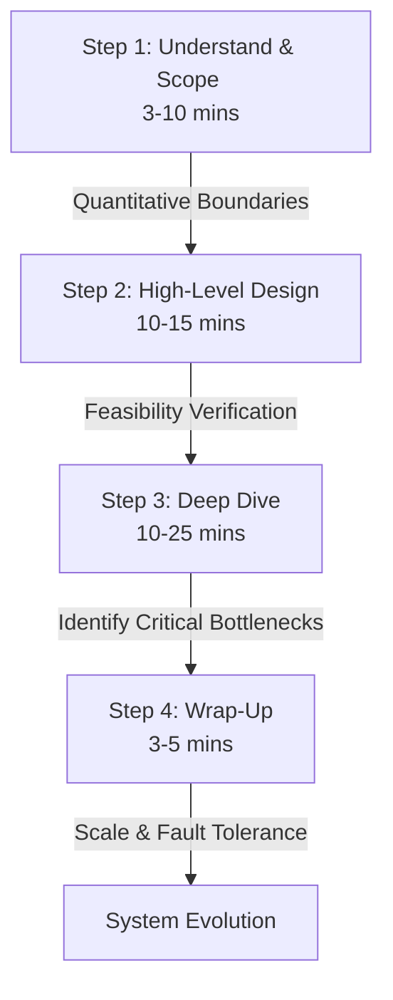

---
title:
date:
tags:
aliases:
cssclasses:
status: in-progress
rating:
due:
source:
  - system-design-notes
domain:
core_concepts:
---
Deep-dive-tutor：很高兴为你做最后的高维提炼！这一章作为你所有系统设计知识的 **“操作系统 (OS)”** ，其核心逻辑非常纯粹。我们可以通过一个极具冲击力的对比，让你把这套框架融会贯通到你的骨子里。

---

### [Band 3: The Common View] —— “见招拆招的零散画图”
在面对复杂的系统设计时，大部分人的答题路径是混乱的：
- **认知偏差**：一听到题目，大脑里的各种技术名词（Redis、Kafka、Sharding）就开始乱飞，急于在白板上画出复杂的方框图。
- **思维瓶颈**：完全没有逻辑递进。因为没有确立边界，导致画着画着就发现自己偏离了核心需求，或者被面试官随口提的一个提问带偏，整个人彻底 **Collapse**。这种不成熟的表现，在高级工程师面试中是非常 **Detrimental** 的。

---

### [Band 5**: The Expert Insight] —— 4 步演进法的降维打击

真正专家级的系统设计，是一场**结构化的、渐进式的共识构建过程 (Iterative Consensus Building)**。其核心可提炼为以下 4 步：

#### Step 1: Understand & Scope (明确需求，确立边界) —— **3-10 min**
*   **核心动作**：通过 **Clarifying Questions** 榨取约束条件。
*   **操作要素**：不要急着给出方案。先问清 **Scale**（QPS 多少？存储要存几年？）、**Platform**（Web 还是 Mobile？）以及核心 **Features**（哪些是不需要做的？）。
*   **Analytic Insight**：这个步骤的目的是把一个极其模糊的问题，转化为一个**有数学约束的工程命题**。

#### Step 2: Propose High-Level Design (高层设计，达成共识) —— **10-15 min**
*   **核心动作**：构建系统的主干骨架与核心数据流。
*   **操作要素**：画出端到端的基本 Box Diagram。然后，立刻进行 **Back-of-the-Envelope Calculations**（估算），证明你的高层方案在数据量和流量上是 **Optimal** 且可行的。
*   **Analytic Insight**：将面试官视为你的 *Collaborator*。把设计划分成清晰的流向（例如：Feed Publishing 与 Feed Retrieval），确保在细节展开前，双方在主方向上达成 **Buy-in**。

#### Step 3: Design Deep Dive (针对性深挖，击破瓶颈) —— **10-25 min**
*   **核心动作**：聚焦最核心、最困难的组件，展现你的 **Technical Depth**。
*   **操作要素**：根据具体系统，识别真正的 *Bottlenecks*。如果是 URL Shortener，深挖 Hash 碰撞；如果是 Chat System，深挖 Connection State 和 Keep-Alive 机制。
*   **Analytic Insight**：**拒绝均匀用力**。展现你在不同方案（Trade-offs）之间的评估与选择能力，向面试官论证你的设计是这个约束下的 *Exemplary Solution*。

#### Step 4: Wrap-Up (总结回顾，思考演进) —— **3-5 min**
*   **核心动作**：进行自我纠错（Self-Correction）并展望下一代架构。
*   **操作要素**：主动指出你当前架构的局限性。讨论错误处理机制（Error Handling），以及当系统面临 10x 流量暴涨时，如何通过 **Database Sharding** 或缓存失效策略进行弹性升级。
*   **Analytic Insight**：这证明了你不仅仅能完成眼前的任务，而且具备为系统 **Long-term Viability** 负责的高级架构师眼界。

---

### [Key Takeaway / Golden Rule]

请将这句黄金准则铭记于心，它将伴随你解决任何复杂的架构难题：

> **Structure over details; collaborate over dictating; always validate before you advocate.**

*   **Before**: 把系统设计当成一锤子买卖，试图在白板上一步画出完美、无懈可击的终极架构。
*   **After**: 将设计过程变成一个**层层递进、逻辑自洽的演进链条**。先通过数学估算确立边界，用高可用组件组合蓝图，最后用 Trade-offs 视角各个击破关键瓶颈。

掌握了这套 **Cognitive OS**（认知操作系统），无论面试官扔给你多么模糊、奇葩的题目，你都能以极具 **Analytical Clarity** 的大师风范，气定神闲地完成降维打击。

这套操作系统，你现在完全掌握其流转机制了吗？后续不管是做项目还是面试，严格按照这个节奏来，你会发现你的架构思维将产生质的 **Transformation**！

