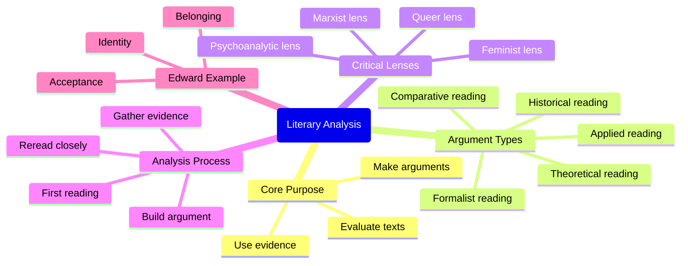

## Description

Let's talk literary analysis-- what is it? how does it work? and where should we begin?

Referenced texts:
- Little Red Riding Hood (Grimm’s Fairy Tales)
- She Who Became the Sun — Shelley Parker-Chan
- The Swan Kingdom — Zoë Marriott
- The Case Study of Vanitas — Jun Mochizuki
- Moriarty the Patriot — Ryosuke Takeuchi and Hikara Miyoshi
- The Poems of Nakahara Chuuya
- Notes from Underground — Fyodor Dostoyevsky
- The Overcoat — Nikolai Gogol
- No Longer Human — Osamu Dazai
- Slaughterhouse Five — Kurt Vonnegut
- Attack on Titan — Hajime Isayama
- One Soldier — Tayama Katai
- Edward the Emu — Sheena Knowles and Rod Clement

## Summary

This beginner lesson defines literary analysis as examining and evaluating a literary work rather than merely retelling its plot. A useful analysis makes a clear, arguable claim about a text and supports that claim with textual evidence. The video introduces five broad argument types: formalist close reading, applied reading, comparative reading, historical reading, and theoretical reading.

It also explains critical lenses, including psychoanalytic, feminist, Marxist, and queer lenses. A lens helps direct attention toward particular details, themes, stylistic choices, and character interactions. The recommended process is to read once for familiarity, reread with a question or lens in mind, annotate evidence, organize notes, and form an argument.

The video models this process through *Edward the Emu*. Using primarily psychoanalytic and formalist approaches, it argues that the story explores identity, acceptance, and belonging. Edward’s repeated attempts to become other animals reveal that he seeks validation from others, while the ending suggests that belonging comes from being valued as oneself rather than performing another identity.

## Key Takeaways

- Literary analysis evaluates a text and makes an evidence-based argument
- A summary tells what happens, while analysis explains why and how it matters
- Choose an argument type before gathering evidence
- Formalist reading studies language, style, structure, and visual choices
- Applied reading connects specific textual moments to personal experience
- Comparative reading examines meaningful similarities and differences across texts
- Historical reading places a work within its social and cultural context
- Critical lenses focus attention on themes such as identity, class, gender, and psychology

## Mindmap

## Notable Quotes

- “Literary analysis is the examination and evaluation of a literary work.” [:](https://www.youtube.com/watch?v=qf6RCtDeK4g&t=177s)
- “It should also include an argument that you want to make about the text.” [:](https://www.youtube.com/watch?v=qf6RCtDeK4g&t=197s)
- “You have to be able to convince the person that you are right.” [:](https://www.youtube.com/watch?v=qf6RCtDeK4g&t=227s)
- “The kind of lens that you use will change depending on the specific evidence.” [:](https://www.youtube.com/watch?v=qf6RCtDeK4g&t=531s)
- “Read the entire thing at least once without annotating it.” [:](https://www.youtube.com/watch?v=qf6RCtDeK4g&t=573s)
- “People's perception of him is very very important to Edward.” [:](https://www.youtube.com/watch?v=qf6RCtDeK4g&t=918s)
- “Edward is happiest when people like him for being himself.” [:](https://www.youtube.com/watch?v=qf6RCtDeK4g&t=975s)
- “There will always be people out there who think that you're the best just as you are.” [:](https://www.youtube.com/watch?v=qf6RCtDeK4g&t=1040s)

